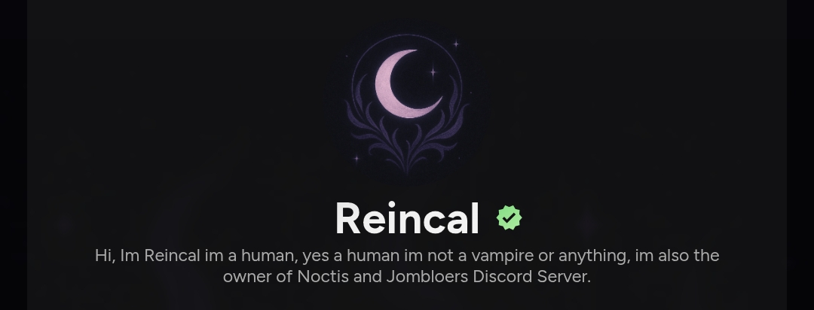

# Reincal - Personal Portfolio Website

[](https://opensource.org/licenses/MIT)
[](https://reincal.is-a.dev)

A modern, responsive personal portfolio website built with vanilla **HTML**, **CSS**, and **JavaScript**. Features real-time Discord status via [Lanyard](https://lanyard.rest/) and Spotify integration.

## ✨ Features

- 🎨 **Glassmorphism Design** - Sleek dark theme with gradients & animations
- 📱 **Fully Responsive** - Perfect on desktop, tablet, mobile
- 👤 **Live Discord Status** - Real-time online/idle/dnd/offline with colored indicators
- 🎵 **Spotify Now Playing** - Current track with direct Spotify links
- 📊 **Smooth Animations** - AOS scroll animations + GSAP
- 📝 **Contact Form** - Working form via FormSubmit.co
- 💎 **Random Quotes** - Daily inspiration from TwaryAPI
- 🚀 **Fast & Lightweight** - No frameworks, pure vanilla JS

## 🖼️ Screenshots

| Hero Section | Projects |
|--------------|----------|
|  |  |

## 🚀 Quick Start

1. **Clone/Download** this repo
2. **Open** `public/index.html` in any browser
3. **Done!** - No build step required

```bash
# Or serve locally
npx serve public
# or python3 -m http.server 8000
```

## 📁 Structure

```
Reincal-main/
├── public/
│   ├── index.html       # Main page
│   ├── contact.html     # Contact form
│   ├── css/             # Styles (style.css, contact.css, 404.css)
│   ├── js/              # Scripts
│   │   ├── lanyard.js   # Discord/Spotify status
│   └── image/           # Assets
├── vercel.json          # Deployment config
├── README.md            # This file!
└── LICENSE              # MIT License
```

## 🔧 Customization

1. **Your Discord ID**: Edit `public/js/lanyard.js` → `subscribe_to_id`
2. **Contact Email**: Update form action in `public/js/main.js`
3. **Projects/Links**: Modify `public/index.html` hero/projects sections
4. **Colors**: Tweak CSS variables in `:root` (`public/css/style.css`)
5. **Images**: Replace `public/image/` assets

## 🌐 Deployment

### Vercel (Recommended)
```bash
npm i -g vercel
vercel --prod
```
Uses `vercel.json` for perfect SPA routing.

### Netlify
Drag `public/` folder to [netlify.com/drop](https://netlify.com/drop)

### GitHub Pages
Upload `public/` contents to `gh-pages` branch.

## 🤝 Lanyard Integration

**Your Discord status** shows live via [Lanyard WebSocket API](https://lanyard.rest/docs/websocket):
- Green dot = Online
- Yellow = Idle  
- Red = Do Not Disturb
- Gray = Offline
- **Spotify** auto-detects + links current track!

**Setup:** Replace Discord ID in `lanyard.js` with yours from https://api.lanyard.rest/v1/users/YOUR_ID

## 📞 Contact Form

Powered by [FormSubmit.co](https://formsubmit.co/) - receives emails directly. Update email in `public/js/main.js`.

## 🎨 Tech Stack

| Frontend | Tools |
|----------|-------|
|  | Vanilla |
|  | Glassmorphism |
|  | ES6+ |

**Libs:** AOS (animations), Font Awesome (icons), Lanyard (status)

## 🙌 Credits

- **Author:** Reincalvin (Kalvin)
- **Design:** Custom glassmorphism
- **APIs:** Lanyard, TwaryAPI, FormSubmit
- **Icons:** [Font Awesome](https://fontawesome.com)

## 📄 License

MIT License - feel free to use/fork! See [LICENSE](LICENSE).

## 🤔 Issues?

[Open an issue](https://github.com/username/reincal/issues) or DM on Discord/Twitter.

---

⭐ **Star this repo if you found it useful!**
